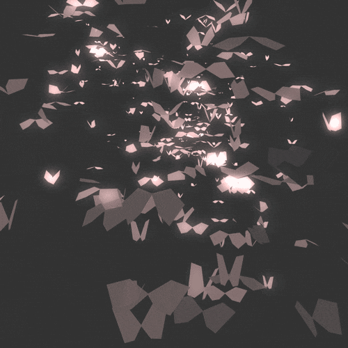

  <!-- BUTTERFLY BANNER -->
  

    

  <!-- JAPANESE GREETING -->
  

   

  

    <b>Backend Developer | Systems Engineering | Distributed Systems</b>
  

  

    Building scalable backends, exploring systems internals, and turning ideas into production-ready software.
  

   

  
  

---

## 👨‍💻 About Me

- 💻 Focused on **backend engineering and systems development**
- ⚙️ Building with **Go, PostgreSQL, Redis, and gRPC**
- 🏗️ Exploring **microservices, distributed systems, and infrastructure**
- 🔐 Interested in authentication, application security, and scalable architectures
- 🚀 Currently building **DevSync**, a developer collaboration platform
- 🎯 Goal: become a strong backend and systems engineer

---

## 🛠️ Tech Stack

  

### ⚙️ Backend & APIs

  
  
  
  

### 🗄️ Databases & Storage

  
  
  
  

### 🐧 Systems & Infrastructure

  

---

## 🚀 What I'm Building

  
<table>
  <tr>
    <td width="50%" valign="top">
      <h3>🚀 DevSync</h3>

      Building a developer collaboration platform with a microservices architecture, designed around workspaces, communication, and developer productivity.

      Working on:
        Authentication with PASETO access and refresh tokens
        Email OTP verification and session management
        Workspace creation, membership, and role-based access
        Service communication and scalable backend architecture
      

      Tech: Go · PostgreSQL · PASETO · Microservices

      ⚙️ Backend & Systems Engineering

      Developing deeper expertise in the systems behind reliable, scalable backend applications, with a focus on security, performance, and infrastructure.

      

      Exploring:
      
        Redis caching, rate limiting, and session storage
        Database design, transactions, and query performance
        Docker, Linux, and deployment infrastructure
        Distributed systems, gRPC, and inter-service communication
      

      Tech: Go · PostgreSQL · Redis · Docker · Linux
    
  </tr>
</table>

---

## 📊 GitHub Statistics

  

  

    

  

---

---

---

---

  
<i>「継続は力なり」</i>

  
Consistency is strength.

  

